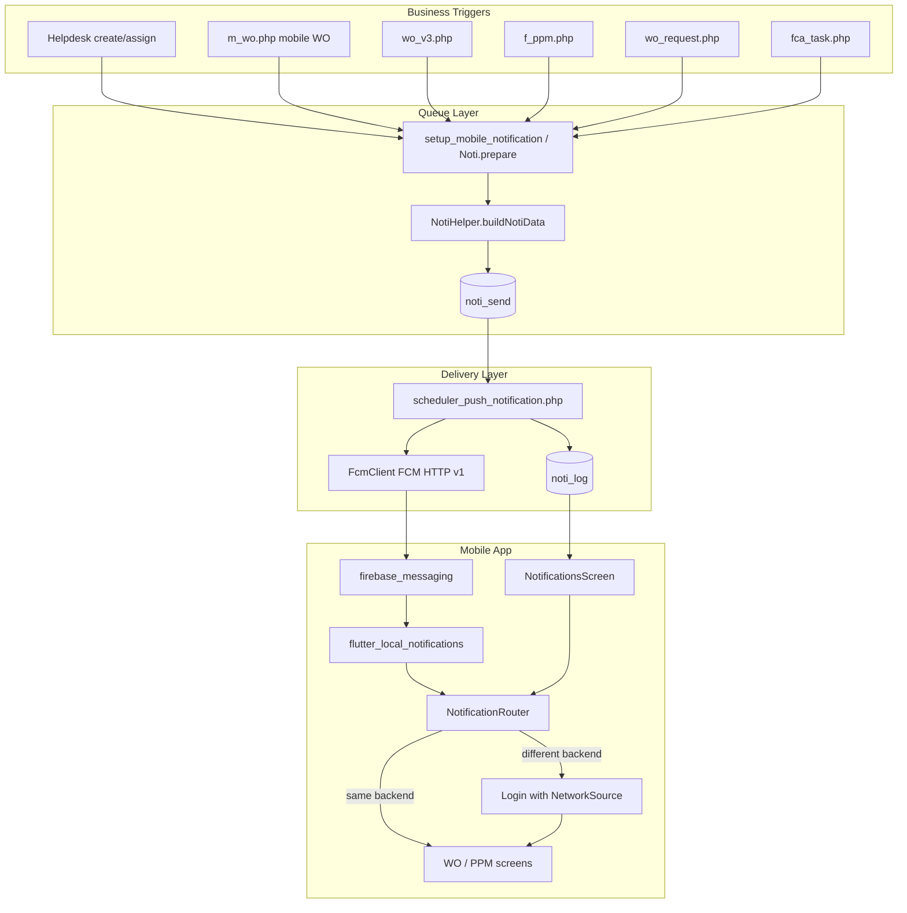

# Notification System — Changes Report

**Date:** 12 August 2026  
**Scope:** Mobile app (`metadata-gfm`) + Backend (`gfm-gems`)  
**Goal:** Make mobile push notifications work end-to-end, with inbox, deep-links, and dual-backend safety.

---

## 1. Summary

Before this work, GEMS could queue push notifications and save FCM tokens, but delivery/display/routing were incomplete:

- Backend used deprecated FCM legacy API with a hardcoded key
- Multi-user queues only sent to one token
- No structured `data` payload for deep-links
- Mobile had no inbox, broken `/notifications` route, weak background handling
- Dual login (GEMS+ / GEMS 2.0) could open WO/PPM against the wrong backend

This work delivers:

1. Reliable FCM HTTP v1 sending (with legacy fallback)
2. Routing payload (`module`, `task_no`, `network_source`)
3. Flutter notification service (foreground / background / tap)
4. In-app notification inbox + unread badge
5. Dual-backend prompt-to-switch deep-link flow

---

## 2. Notification Tree (End-to-End)



---

## 3. Notification Decision Points

```mermaid
flowchart TD
    Start[Push or inbox tap] --> Parse[Parse payload]
    Parse --> HasNS{network_source present?}
    HasNS -->|No| UseCurrent[Treat as current backend]
    HasNS -->|Yes| Compare{Matches current NetworkSource?}
    UseCurrent --> Open
    Compare -->|Yes| Open[Open module destination]
    Compare -->|No| Prompt[Dialog: Switch and Open?]
    Prompt -->|Cancel| Stay[Stay put]
    Prompt -->|Confirm| Pending[Save pending payload]
    Pending --> Clear[Logout + set NetworkSource]
    Clear --> LoginUI[Login preselected]
    LoginUI --> Token[Register FCM token]
    Token --> Consume[Consume pending payload]
    Consume --> Open

    Open --> Mod{module}
    Mod -->|wo| WOSearch[SearchComplaint + task_no]
    Mod -->|ppm| PPMSearch[Search + task_no]
    Mod -->|mr| WorkOrder[/workorder]
    Mod -->|fca / other| Home[/homepage]
```

---

## 4. Module / Template Map

| noti_text_id | Module | Typical event |
|-------------:|--------|---------------|
| 1–4 | `ppm` | Pending verify/check, reopen, completed |
| 5–16 | `wo` | Complaint, assign, return, verify, reject |
| 17–21 | `mr` | Material request workflow |
| 22–25 | `fca` | Observation / recommendation / validation |

Helpdesk assign path (`wo.php` → `submit_helpdesk_complaint`):

- Work Order → push template **6** to **Assigned To**
- Work Request → push template **12** to **Assigned To**

---

## 5. Dual-Backend Model

| App login label | `network_source` | Domain |
|-----------------|------------------|--------|
| GEMS+ | `gemsPlus` | `https://gems.jkr.gov.my` |
| GEMS 2.0 | `gems20` | `https://gfmgems.globalfm.com.my` |

Each backend deployment sets:

```ini
[app]
network_source = gemsPlus   ; or gems20
```

Every push carries that value in `noti_data` / FCM `data`.

---

## 6. Files Changed / Added

### Backend (`gfm-gems`)

| File | Change |
|------|--------|
| `api/class/FcmClient.php` | **New** — FCM HTTP v1 + OAuth service account; legacy fallback |
| `api/class/NotiHelper.php` | **New** — module mapping, multi-user normalize, `network_source` stamp |
| `api/class/NotiMobile.php` | **New** — inbox list / unread / mark read |
| `api/noti_mobile.php` | **New** — REST API entry |
| `api/class/Noti.php` | Store `noti_data` when queueing |
| `api/function/f_email.php` | Multi-user fix, FCM via `FcmClient`, copy `noti_data` to log |
| `api/library/config.ini` | `[fcm]` + `[app] network_source` |
| `.htaccess` | Routes for `/noti_mobile/` |
| `maintenance/add_noti_data_columns.sql` | `noti_data`, `noti_log_read_at` |
| `maintenance/test_push_notification.php` | Manual queue/send test script |

### Mobile (`metadata-gfm`)

| File | Change |
|------|--------|
| `lib/service/notification_service.dart` | **New** — FCM init, local display, background, token refresh |
| `lib/service/notification_router.dart` | **New** — deep-link + dual-backend prompt |
| `lib/service/pending_notification_store.dart` | **New** — pending payload after backend switch |
| `lib/model/notification_item.dart` | **New** — inbox model |
| `lib/data/repository/notification_repository.dart` | **New** — `/noti_mobile` client |
| `lib/controller/Notifications/notifications.dart` | **New** — inbox UI |
| `lib/main.dart` | Use `NotificationService`; register `/notifications`; Login args |
| `lib/controller/Homepage/homepage.dart` | Token save, unread badge, consume pending |
| `lib/controller/login.dart` | Token after login; consume pending; preselect source |
| `lib/utils/network.dart` | `LoginArguments` |
| `lib/controller/WorkOrder/complaintSearch.dart` | `initialTaskNo` |
| `lib/controller/PPM/search.dart` | `initialTaskNo` |
| `android/.../AndroidManifest.xml` | `POST_NOTIFICATIONS` |

---

## 7. API Surface (Mobile Inbox)

| Method | Endpoint | Purpose |
|--------|----------|---------|
| GET | `/noti_mobile/by_userId` | Latest 50 notifications |
| GET | `/noti_mobile/unread_count` | Badge count |
| PUT | `/noti_mobile/{id}/read` | Mark one read |
| PUT | `/noti_mobile/read_all` | Mark all read |
| POST | `/api/m_ppm.php` `action=save_token` | Register FCM token |

---

## 8. Push Payload Shape

```json
{
  "noti_text_id": "6",
  "module": "wo",
  "task_no": "WO-2026-00123",
  "network_source": "gemsPlus"
}
```

FCM message includes:

- `notification.title` / `notification.body` (system tray)
- `data.*` (routing for app tap / local notification payload)

---

## 9. Operational Checklist

1. Run DB migration: `maintenance/add_noti_data_columns.sql`
2. Place Firebase service account JSON outside web root
3. Set `config.ini` `[fcm] service_account_path`
4. Set `config.ini` `[app] network_source` per environment
5. Upload APNs `.p8` in Firebase for iOS (`com.GFM.GEMS`)
6. Ensure cron runs `api/scheduler_push_notification.php` every 1–5 minutes
7. Rebuild/install mobile app

Manual test:

```bash
php maintenance/test_push_notification.php
# or dry-run:
php maintenance/test_push_notification.php --dry-run
```

---

## 10. What Was Intentionally Not Done

- Multi-device token table (still one `sys_user.user_token` per user)
- Merged inbox across GEMS+ and GEMS 2.0
- Silent JWT swap without re-login
- Full FCM HTTP v1-only (legacy fallback kept if service account missing)

---

## 11. Quick Test Paths

1. **Same backend:** Login GEMS+ → Helpdesk assign to admin → push arrives → tap opens WO search  
2. **Inbox:** Bell icon → list → tap item → same router  
3. **Dual backend:** Push stamped `gems20` while app on `gemsPlus` → prompt → Switch & Open → login → deep-link  
4. **Cancel prompt:** stays on current backend  

---

*This report reflects the notification work completed across both repositories as of 12 Aug 2026.*
